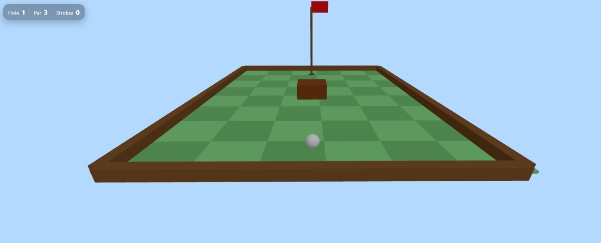

# 🏌️‍♀️ Mini Golf Game


Welcome to **Mini Golf**, a web-based 3D mini-golf game built with **React**, **Vite**, and **Three.js**.  
This project demonstrates interactive physics, 3D rendering, and responsive gameplay.

---

## 🎮 Game Overview

Navigate through multiple challenging courses, aim precisely, and sink the ball in as few strokes as possible!  
Each level presents unique obstacles that test your **strategy and precision**.

---

## 🏟️ Levels

- **Level 1 – Beginner Course**  
  - Simple golf course with a stationary wooden obstacle  
  - Perfect for learning aiming and controlling ball speed  
  - Smooth trajectory line visualization  

- **Level 2 – Intermediate Challenge**  
  - Golf course with four moving obstacles 
  - Requires timing and careful aiming to avoid collisions  
  - Trajectory visualization and collision detection active  

- **Level 3 – Expert Mode**  
  - Golf course with a stream flowing down the middle 
  - River pulls the ball downstream, requiring skillful aiming  
  - Challenges momentum and speed  

---

## ✨ Features

- **3D Gameplay** – Realistic 3D environment and ball physics  
- **Trajectory Visualization** – Predict your shot with a dynamic path line  
- **Confetti Effects** – Celebration animation when the ball enters the hole  
- **Dynamic Camera Control** – Smooth camera transitions and adjustable angles  
- **Responsive Design** – Play seamlessly on desktop and mobile  
- **Easy Level Expansion** – Modular level design allows easy addition of new courses  

---

## 🛠️ Technologies Used

- **React** – Frontend library for UI components  
- **Vite** – Fast development server and optimized build tool  
- **Three.js** – 3D rendering engine for immersive gameplay  
- **ESLint** – Code quality and linting

[](https://skillicons.dev) 

---

## 🚀 Getting Started

### 1. Clone the repository
```bash
git clone https://github.com/noyonikadutta/mini-golf.git
```

### 2. Navigate to the project directory
```bash
cd mini-golf
```

### 3. Install dependencies
```bash
npm install
```

### 4. Start the development server
```bash
npm run dev
```

### 5. Open your browser
Go to: [http://localhost:5173](http://localhost:5173) to play the game


## 🌐 Live Demo

- Check out the live demo here: [Mini Golf Game Demo](https://noyonikadutta.github.io/mini-golf)  
> *(Replace with your actual GitHub Pages or deployed link)*

---

## 📸 Screenshots

- **Level 1 – Beginner Course**  


- **Level 2 – Intermediate Challenge**  


- **Level 3 – Expert Mode**  


---

## 🤝 Contributors

- **[Noyonika Dutta](https://www.github.com/noyonikadutta)**
- **[Ananth G Karanth](https://github.com/SoiledSalmon)**
- **[Mohit K](https://github.com/Mohit-Karkera)**
- **[Nischal](https://github.com/nischal-72)**


  
---

## 📄 License

- This project is licensed under the **MIT License**.  
- See [LICENSE](LICENSE) for details.

---

